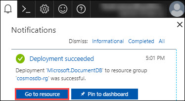

# Lab1: Introduction to Cosmos DB
## 1.	Introduction to Azure Cosmos DB
### 1.1	Create Cosmos DB Account with SQL API
1.	**Launch** a browser and **navigate** to https://portal.azure.com. **Login** with your Microsoft Azure credentials. 
2.	To toggle **show/hide** the Portal menu options with icon, Click on the Show Menu button.      
 
3.	Click on the **New** icon in the Menu navigation bar. 
 
4.	Type “**Cosmos db**” in the search box in the new blade that appears. 
  
5.	Click on **Azure Cosmos DB** from the list that appears. 
 
6.	Click on Create in the **Azure Cosmos DB** blade. 
 
7.	Provide the following details in the Add directory blade. 
    -	ID : Provide any unique name.
    -	API : **SQL** 
    -	Resource group : Select **Create new** and type the name of the new resource group to be created.  
    Click on **Create**. 
 
8.	After completion a notification will be raised as below. 
 
### 1.2	Create new DB and collection
1.	Go to the created Cosmos DB by clicking on **Go to Resource** option in the notification bar. 
 
2.	In the Azure Cosmos DB account blade that appear, Click on **Overview**. 
 
3.  Click on **+Add Collection**.  
 
4.  provide the following details in the Add Collection blade that appears. 
    - Database id : Type a new database id
    - Collection id : Type a new collection id
    - Storage Capacity : **Fixed(10 GB)**
    - Throughput : **1000** 
    Click on **OK**. 
     
### 1.3	Load Data
#### 1.3.1	Access Windows VM and Launch Data migration tool.
1.  Download the data which we want to migrate into cosmos DB by clicking [here](http://portalcontent.blob.core.windows.net/samples/NutritionData.json) 
2.  **Launch** your **data migration tool** by opening the **dtui.exe** application. 
    
3.  In the **DocumentDB Data Migration Tool** blade that appear, Click on **Next**. 
    
4.  In the source information page that appear, select Import from **JSON file(s)** and click on **Add Files**. 
    
5.  Select the downloaded file, **NutritionData.json** and click on open. 
    
6.  Then in the **source information** page, click on **Next** and a Target information page will appear.     
7.  Now go to your **Azure Cosmos DB account** and Click on **keys** menu under the **setting** tile.     
8.  Then **copy** the **Primary Connection String** and paste the connection string in a notepad. 
 
9.  Now click on **Overview** menu in the **Azure Cosmos DB account** page and copy the newly created database name, i.e, mynewdb.  
10.  Now open the notepad and after the connection string add the text **Database=mynewdb**. 
    
11.  Then go back to the **Target information** page of the Data migration tool and provide the following details. 
       - Export to: **DocumentDB-Bulk import(Single partition collections)**. 
       - Connection String: Copy the entire text from the notepad and paste it here. 
        
    After this Click on **Verify** button to verify the connection. Then a notification blade will pop-up which says **Successfully             connected to documentDB account**.In that notification blade click on **OK**.  
        
       - Collections: Enter the name of the new collection, (i.e, **mynewcollection**).  
    After this Click on **Add** button to add the collection. 
         
       - Collection throughput: Copy the collection **throughput** from the **overview** page of **Azure Cosmos DB account** and paste it here. 
    Click on **Next** button.
     
     
12.  Then an **advanced** page will appear, in that click on **Next**.
      
13.  Then a Summary page will appear, in that click on **Import**.
      
14.  Now the import will start.
      

