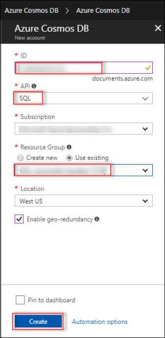
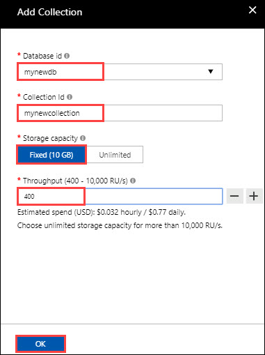
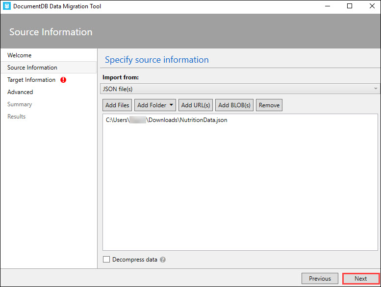

# Lab1: Introduction to Cosmos DB
## 1.	Introduction to Azure Cosmos DB
### 1.1	Create Cosmos DB Account with SQL API
1.	**Launch** a browser and **navigate** to https://portal.azure.com. **Login** with your Microsoft Azure credentials.<br/>
2.	To toggle show/hide the Portal menu options with icon, Click on the **Show Menu** button.<br/>     
<br/>
3.	Click on the **New** icon in the Menu navigation bar.<br/>
<br/>
4.	Type “**Cosmos db**” in the search box in the new blade that appears.<br/>
 <br/>
5.	Click on **Azure Cosmos DB** from the list that appears.<br/>
<br/>
6.	Click on Create in the **Azure Cosmos DB** blade.<br/>
<br/>
7.	Provide the following details in the Add directory blade.<br/>
    -	ID : Provide any unique name.
    -	API : **SQL** 
    -	Resource group : Select **Create new** and type the name of the new resource group to be created. <br/>
    Click on **Create**.<br/>
<br/>
8.	After completion a notification will be raised as below.<br/>
<br/>
### 1.2	Create new DB and collection
1.  **Launch** a browser and **navigate** to https://portal.azure.com. **Login** with your Microsoft Azure credentials.<br/>
2.  Click on the **Resource Group** icon on the **Menu navigation bar**.<br/>
<br/>
3.  Now in the **Resource Groups** blade that appear, select the created resource group for cosmos DB, (i.e, **cosmosdb-rg**).<br/>
<br/>
4.  Then click on the created Azure Cosmos DB account(i.e,cosmosdb321).<br/>
<br/>
5.	In the Azure Cosmos DB account blade that appear, Click on **Overview**.<br/>
<br/>
6.  Click on **+Add Collection**.<br/> 
<br/>
7.  provide the following details in the Add Collection blade that appears.<br/>
    - Database id : Type a new database id
    - Collection id : Type a new collection id
    - Storage Capacity : **Fixed(10 GB)**
    - Throughput : **1000**<br/>
    Click on **OK**.<br/>
<br/>    
### 1.3	Load the Data in to the Cosmos DB.
#### 1.3.1	Access Windows VM and Launch Data migration tool.
1.  Download the data which we want to migrate into cosmos DB by clicking [here](http://jsonstudio.com/wp-content/uploads/2014/02/stocks.zip)<br/>
A zip file will download, extract and open the file to view the json data set.<br/>
2.  **Launch** your **data migration tool** by opening the **dtui.exe** application.<br/>
<br/>   
3.  In the **DocumentDB Data Migration Tool** blade that appear, Click on **Next**.<br/>
<br/>   
4.  In the source information page that appear, select Import from **JSON file(s)** and click on **Add Files**.<br/>
<br/>   
5.  Select the downloaded file, **stocks.json** and click on open.<br/>
<br/>   
6.  Then in the **source information** page, click on **Next** and a Target information page will appear.<br/><br/>
7.  **Launch** a browser and **navigate** to https://portal.azure.com. **Login** with your Microsoft Azure credentials.<br/>
8.  Click on the **Resource Group** icon on the **Menu navigation bar**.<br/>
<br/>
9.  Now in the **Resource Groups** blade that appear, select the created resource group for cosmos DB, (i.e, **cosmosdb-rg**).<br/>
<br/>
10.  Then click on the created **Azure Cosmos DB account(i.e,cosmosdb321)**.<br/>
<br/>
11.  In the **Azure Cosmos DB account** blade, Click on **keys** menu under the **setting** tile.<br/>
<br/>   
12.  Then **copy** the **Primary Connection String** and paste the connection string in a notepad.<br/>
<br/>
13.  Now click on **Overview** menu in the **Azure Cosmos DB account** page and copy the newly created database name, i.e, mynewdb.<br/><br/>
14.  Now open the notepad and after the connection string add the text **Database=mynewdb**.<br/>
<br/>   
15.  Then go back to the **Target information** page of the Data migration tool and provide the following details.<br/>
       - Export to: **DocumentDB-Bulk import(Single partition collections)**.<br/>
       - Connection String: Copy the entire text from the notepad and paste it here.<br/>
    <br/>   
    After this Click on **Verify** button to verify the connection. Then a notification blade will pop-up which says **Successfully             connected to documentDB account**.In that notification blade click on **OK**. <br/>
    <br/>   
       - Collections: Enter the name of the new collection, (i.e, **mynewcollection**).  
    After this Click on **Add** button to add the collection.<br/>
    <br/>    
       - Collection throughput: Copy the collection **throughput** from the **overview** page of **Azure Cosmos DB account** and paste it here.<br/>
    Click on **Next** button.
    <br/>
    <br/>
16.  Then an **advanced** page will appear, in that click on **Next**.
     <br/>
17.  Then a Summary page will appear, in that click on **Import**.
     <br/>
18.  Now the import will start.It will take a couple of minutes to complete.
     <br/>
### 1.4	Use Data Explorer to interact with collection
#### 1.4.1	Verify Data in Azure Portal
1.  **Launch** a browser and **navigate** to https://portal.azure.com. **Login** with your Microsoft Azure credentials.<br/>
2.  Click on the **Resource Group** icon on the **Menu navigation bar**.<br/>
<br/>
3.  Now in the **Resource Groups** blade that appear, select the created resource group for cosmos DB, (i.e, **cosmosdb-rg**).<br/>
<br/>
4.  Then click on the created **Azure Cosmos DB account(i.e,cosmosdb321)**.<br/>
<br/>
5.  In the **Azure Cosmos DB account** blade that appear, Click on **Data Explorer**.<br/>
<br/>
6.  In the **Data Explorer page**, Expand **mynewdb** to view the collections.<br/>
<br/>
7.  Then expand **mynewcollection**.<br/> 
<br/>  
8.  Now click on **Documents** to view the data.<br/> 
<br/>  
9.  You can see the data by clicking the **IDs**.<br/>
<br/>  
#### 1.4.2  Query data
1.  In the **Azure Cosmos DB account** blade that appear, Click on **Query Explorer**.<br/>
<br/>
2.  In the page that appear, select the our **Database(mynewdb)** and **Collection(mynewcollection)**.<br/>
<br/>
3.  Now type your query based on the requirement in the provided space and click on **Run Query**.<br/>
```
For example: SELECT * FROM c  WHERE c.Sector= "Financial"
```
<br/>
4.  Now we can see all the data with **Sector = Financial**<br/>
<br/>
### 2.  Geo-Replication
#### 2.1   Create replication in multiple regions
1.  **Launch** a browser and **navigate** to https://portal.azure.com. **Login** with your Microsoft Azure credentials.<br/>
2.  Select the **Azure Cosmos DB account(i.e,cosmosdb321)**.<br/>
3.  In the Cosmos DB account page click on **Replicate data globally** tab under the **Settings** tile.<br/> 
<br/>
4.  In the new page that appear, click on **Add new region** under **Read regions**.<br/>
<br/>
5.  Now select the required **region** (say Central US) from the list and click on **OK**.<br/> 
<br/>
6.  If you want to add more regions, click on Add new region again and select the required region and click on **Save**.
<br/>
<br/>
