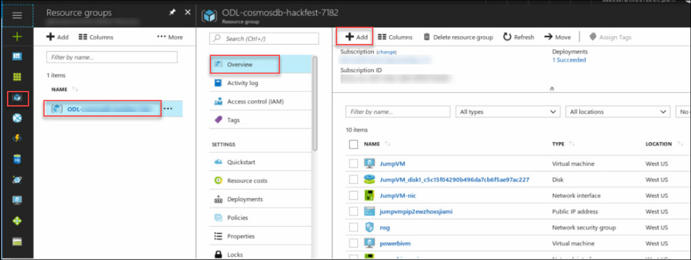
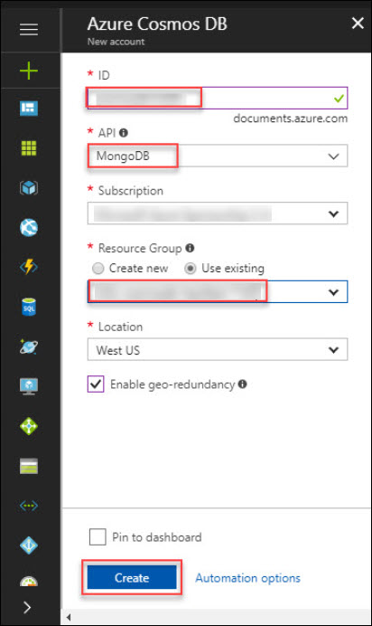

# Lab 2: Migrate MongoDB Applications to Azure Cosmos DB(Mongo API)
## Scenario 1 Understand the Flight Reservation App, Local MongoDB and test Application
### Understand Flight reservation application 
#### Access Jump VM 
1. From azure portal, Go to virtual machine and select the JumpVM. In Overview section, click on Connect button. It will show username with IP address copy that IP address.

   <br/>

1. Click on start button and search for **Remote Desktop Connection** and click on it.

1. Remote Desktop Connection window will pop-up in that provide the IP Address that you copied in above step.

<br/>

1. Click on **Yes** button in Remote Desktop Connection Wizard.

<br/>

1. Enter the credentials provided in the mail to connect to VM.

<br/>

    > Note If you get err:connecting at first login: Click OK and try again.

#### Launch VS Code and understand application components and hierarchy 

1. Once you are logged in the Ubuntu OS click on Application for accessing visual studio code as shown blow:

<br/>

1. VS Code should have src folder already opened, Notice the folders hierarchy 

<br/>

1. ContosoAir application is two tiered application, One frontend application built on AngularJS named **ContosoAir.Website** and API application named **ContosoAir.Services** build with NodeJS. 

1. All connectivity information required for the API application is maintained in **config.js** , As shown below.
<br/>

1. Following is the file system location for application binaries /home/CosmosDB-Hackfest/ContosoAir/src/

<br/>

#### Access Local MongoDB and Verify Collections

1. Start the mongodb Service by running **sudo service mongod start** and  verify the mongoDB database while running the mongo as shown below:

<br/>

1. You can also verify the records in mongoDB database while running the following commands. Copy the db_name(contosoairdb3) for future use. Note down that there are 5 collections used by the Application
```bash
show dbs 
use <db_name>
show collections
```
<br/>

#### Execute and Test the Application Locally

1. To start the ContosoAir app service layer, go to /home/CosmosDB-Hackfest/ContosoAir/src/ContosoAir.Services in file system, right click and select **Open Terimal Here** as shown below.

<br/>


1. Run **npm start** command. Application should start, Incase of any errors make sure you're in right directory as instructed in previous step.Minmize the terminal once command is executed, do not exit or CTRL+C.


<br/>

1. Now, to start the ContosoAir Website layer, go to /home/CosmosDB-Hackfest/ContosoAir/src/ContosoAir.Website. Open terminal from there and run **ng serve** command in terminal. Minmize the terminal once command is executed, do not exit or CTRL+C.

<br/>

    > Note This  may take upto a minute to start this website. 

1. Copy the **localhost URL** [http://localhost:4200](http://localhost:4200) from the **terminal** and paste it in **Mozilla firefox** browser and press enter. There's a shortcut created for your already on desktop for this, you can open website using that as well.

1. You will see the sign-up page. You need to login to App using your Microsoft Account(formerly live-id). If you do not have a live-id, you can create one by following instructions given on page.


<br/>

1. Once you get login, you will be redirected to **ContosoAir app**.

<br/>

1. Enter **Departure date** and **Return date** in **YYYY-MM-DD** format and click **Find Flights** button.

<br/>
 


## Scenario 2 Migrate Application data to Cosmos DB

### Create Cosmos DB with Mongo API
1. Open Azure Portal with your credential and Click on Add button.

<br/>

1. Search for Azure Cosmos DB and Select it.

<br/>
1. Click on create button.

<br/>
1. Populate the below parameters as shown below.
* **ID**:(any valid name)
* **API**: select **Mongo DB** from the dropdown.
* **Resource Group**: Choose use existing Resource Group.

<br/>

1.	After deployment gets completed, click on **Go to resource** to verify that resource is successfully deployed.

<br/>

1. **Go to Connection String** and Copy all the parameters (Host, Port, Username, Password, Primary Connection String) in notepad for future use
<br/>

### Migrate Database to Azure Cosmos DB
In this exercise, We will use mongoexport to export the data from MongoDB running locally in the jump-VM and then we will use mongoimport to insert this dataset into newly created Cosmos DB.

1.	Open Terminal on Jump VM,(Alternatively you can also access Jump VM on SSH by any ssh tool such as Putty), verify that MongoD Service is running. Issue following commands to export the each collection in the mongo db database to a local bkp file. 

```bash
sudo mongoexport --host localhost --db contosoairdb3 --collection BookingsCollection --out BookingsCollection.bkp
sudo mongoexport --host localhost --db contosoairdb3 --collection DealsCollection --out DealsCollection.bkp
sudo mongoexport --host localhost --db contosoairdb3 --collection FlightsCollection --out FlightsCollection.bkp
sudo mongoexport --host localhost --db contosoairdb3 --collection SeatsCollection --out SeatsCollection.bkp
sudo mongoexport --host localhost --db contosoairdb3 --collection feedbackdb --out feedbackdb.bkp
```

 <br/>

2.	Now, we will import this MongoDB on Azure Cosmos DB (MongoDB) and replace the HOST, PORT, USERNAME and PASSWORD with the parameters in below command with values you copied in above step.

```bash
mongoimport --host <HOST>:<PORT> -u <USERNAME> -p <PASSWORD> --ssl --sslAllowInvalidCertificates --db contoairdb3 --collection BookingsCollection --file BookingsCollection.bkp

mongoimport --host <HOST>:<PORT> -u <USERNAME> -p <PASSWORD> --ssl --sslAllowInvalidCertificates --db contoairdb3 --collection DealsCollection --file DealsCollection.bkp

mongoimport --host <HOST>:<PORT> -u <USERNAME> -p <PASSWORD> --ssl --sslAllowInvalidCertificates --db contoairdb3 --collection FlightsCollection --file FlightsCollection.bkp

mongoimport --host <HOST>:<PORT> -u <USERNAME> -p <PASSWORD> --ssl --sslAllowInvalidCertificates --db contoairdb3 --collection SeatsCollection --file SeatsCollection.bkp

mongoimport --host <HOST>:<PORT> -u <USERNAME> -p <PASSWORD> --ssl --sslAllowInvalidCertificates --db contoairdb3 --collection feedbackdb --file feedbackdb.bkp
```

 <br/>


1. Data is now migrated, lets verify this in Azure Portal, Switch to Azure Portal as launched earlier navigate to Resource groups option present in the favourites menu on the left side panel and select the resource group then click on your newly created Azure Cosmos DB Account.

1. Click on **Data Explorer** option. It will display the collection created in Azure Cosmos DB Account. You should see newly created DB along with collection, you may browse the documents in collections.

<br/>

### Update Application to use Cosmos DB 


1. Go back to Visual Studio Code IDE in Jump VM and enter Primary Connection String Against **MONGO_DB_COONECTION_STRING**(add database name contosoairdb3 before question mark in primary connection string) as in the config.js.

```bash
mongodb://cosmosdb12345:vMTETikja355VZjnJQGC3gwdLaR8x
