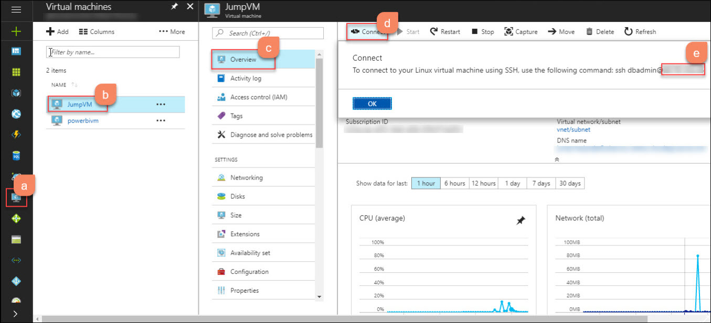
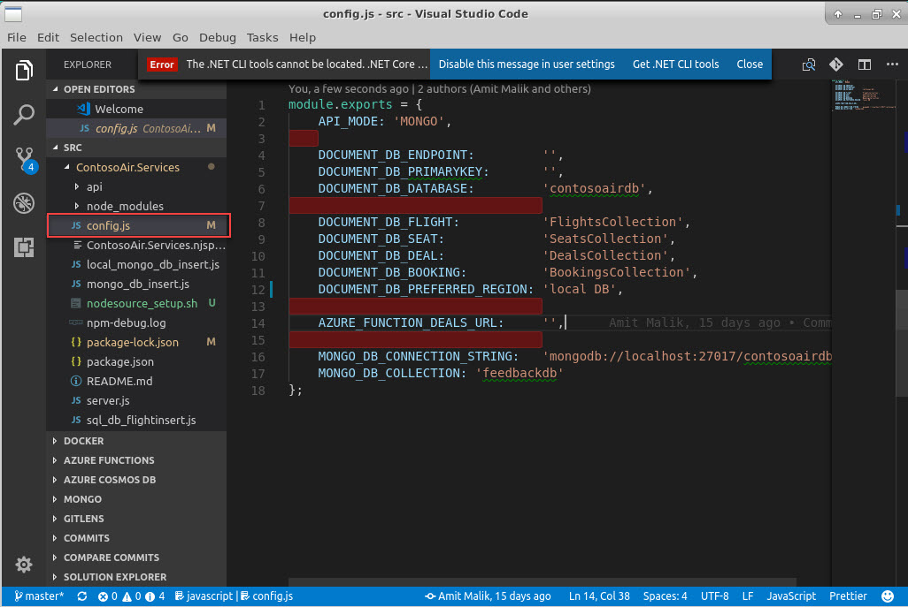
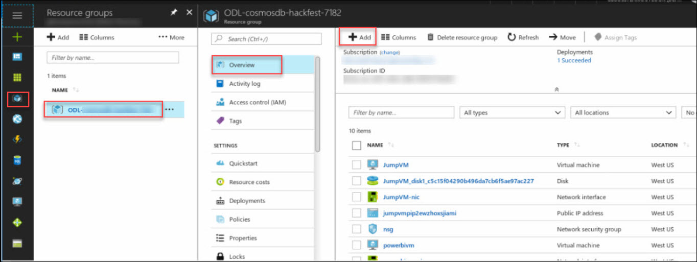
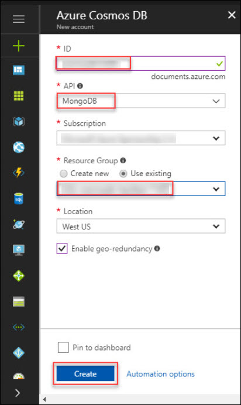

# Lab 2a: Migrate MongoDB Applications to Azure Cosmos DB(Mongo API)
## 1. Understand the Flight App and Migrate the database to Azure Cosmos DB
### 1.1 Understand Flight reservation application 
#### 1.1.1	Access Jump VM 
1. From azure portal, Go to virtual machine and select the JumpVM. In Overview section, click on Connect button. It will show username with IP address copy that IP address.
<br/>
2. Click on start button and search for **Remote Desktop Connection** and click on it.
3. Remote Desktop Connection window will pop-up in that provide the IP Address that you copied in above step.
<br/>
4. Click on **Yes** button in Remote Desktop Connection Wizard.

<br/>
5. Enter the credentials provided in the mail to connect to VM.

<br/>
#### 1.1.2	Launch VS Code and understand application components and hierarchy 
1. Once you are logged in the Ubuntu OS click on Application for accessing visual studio code as shown blow:
<br/>
2. Now, in ContosoAirServices double click on the config.json from the Explorer file to open.
<br/>
3. To start the ContosoAir app service layer, go to /home/CosmosDB-Hackfest/ContosoAir/src/ContosoAir.Services. Click right side of mouse and click on **Open Terimal Here** as shown below.
<br/>
4. Run **npm start** command.
<br/>
5. Now, to start the ContosoAir Website layer, go to /home/CosmosDB-Hackfest/ContosoAir/src/ContosoAir.Website. Open terminal from there and run **np serve** command in terminal.
<br/>
6. Copy the **localhost URL** [http://localhost:4200](http://localhost:4200) from the **terminal** and paste it in **Mozilla firefox** browser and press enter.
7. You will see the sign-up page. Enter your microsoft Credential here.  
<br/>
8. Once you get login, you will be redirected to **ContosoAir app**.
<br/>
9. Enter **Departure date** and **Return date** in **YYYY-MM-DD** format and click **Find Flights** button.
<br/>
 
   > **Note:** If the browser refresh continuously then please open the **localhost URL** [http://localhost:4200](http://localhost:4200) in different browser i.e. **Edge browser** <br/>

## 2. Create CosmosDB and Migrate Database
### 2.1 Create CosmosDbB with Mongo API
1. Open Azure Portal with your credential and Click on Add button.
<br/>
2. Search for Azure Cosmos DB and Select it.

<br/>
3. Click on create button.

<br/>
4. Provie the following parameters and Click on Create button:
ID: Unique ID for cosmos name
API: Select **MongoDB**
Resource Group: use existing rsource group

<br/>
5. Once deployment get succeed Click On **Go to resource**.

<br/>
6. Scroll Down to connection String and copy Host, Username, Primary Key and Primary Connection String for futher use.
<br/>

### 2.2 Migrate Database and Run the application
1.	Once, you get connected to your JumpVM. Use the below command to export the data from JumpVM.
``
sudo mongoexport --host localhost --db contosoairdb3 --collection BookingsCollection --out BookingsCollection.bkp

sudo mongoexport --host localhost --db contosoairdb3 --collection DealsCollection --out DealsCollection.bkp

sudo mongoexport --host localhost --db contosoairdb3 --collection FlightsCollection --out FlightsCollection.bkp

sudo mongoexport --host localhost --db contosoairdb3 --collection SeatsCollection --out SeatsCollection.bkp

sudo mongoexport --host localhost --db contosoairdb3 --collection feedbackdb --out feedbackdb.bkp
``
<br/>
2.	Now, we will import this MongoDB on Azure Cosmos DB (MongoDB) and replace the HOST, PORT, USERNAME and PASSWORD with the parameters in below command with values you copied in above step.
``
mongoimport --host <HOST>:<PORT> -u <USERNAME> -p <PASSWORD> --ssl --sslAllowInvalidCertificates --db <db_name> --collection todos --file <BackupFileName>
``
<br/>
3. Go back to Visual Studio Code IDE and paste the URI value against DOCUMENT_DB_ENDPOINT, PRIMARY KEY against DOCUMENT_DB_PRIMARYKEY  Primary Connection String Against MONGO_DB_COONECTION_STRING(add database name before question mark in primary connection string) as in the config.js.
<br/>
4. Navigate back to the Azure Portal's Resource groups option present in the favourites menu on the left side panel and select the resource group "" and click on Azure Cosmos DB Account then, click on Replicate data globally option present under SETTINGS section in Cosmos DB Account blade.
5. Copy the WRITE REGION and paste it against DOCUMENT_DB_PREFERRED_REGION key in config.js file which is already opened in Visual Studio Code IDE and save this file.
6. Now, to start the ContosoAir app service layer, go to /home/CosmosDB-Hackfest/ContosoAir/src/ContosoAir.Services. Click right side of mouse and click on **Open Terimal Here** as shown below.
<br/>
4. Run **npm start** command.
<br/>
5. Now, to start the ContosoAir Website layer, go to /home/CosmosDB-Hackfest/ContosoAir/src/ContosoAir.Website. Open terminal from there and run **np serve** command in terminal.
<br/>
6. Switch to Azure Portal as launched in Part A, navigate to Resource groups option present in the favourites menu on the left side panel and select the resource group then click on Azure Cosmos DB Account named .
7. Click on Data Explorer option. It will display the collection created in Azure Cosmos DB Account.
<br/>
6. Copy the **localhost URL** [http://localhost:4200](http://localhost:4200) from the **terminal** and paste it in **Mozilla firefox** browser and press enter.
7. You will see the sign-up page. Enter your microsoft Credential here.  
<br/>
8. Once you get login, you will be redirected to **ContosoAir app**.
<br/>
9. Enter **Departure date** and **Return date** in **YYYY-MM-DD** format and click **Find Flights** button.
<br/>


## Update and test Application

# Cosmos DB Concepts

## Partitioning

## Global Distribution

## Consistency 

# Cosmos DB Change Feed

## Create an Azure function

## Create a function with Deal Data

  > _Let's create an Azure Function to retrieve data of flight deals._

1. Go to **Resource groups** option 
   present in the favourites menu on the left side panel and select the resource group **<inject story-id="story://Content-Private/content/dfd/SP-GDA/gdaexpericence1/story_a_gda_using_cosmosdb" key="myResourceGroupName"/>** and click on Azure Function named **<inject story-id="story://Content-Private/content/dfd/SP-GDA/gdaexpericence1/story_a_gda_using_cosmosdb" key="azureFunctionName"/>**.
 
1. Hover over the **Functions** under **Functions Apps** and click on **+ sign** besides **Functions**.
  
1. Now, click on the **Custom function** link present at the bottom of the page.

    

1. Click on **C#** template available in **HTTP trigger** section and name the function as "**FetchDealsData**" in **Name** textbox and click **Create** button.
1. A function with sample default code would get created. Now, replace the sample default code with the code snippet given below.

    ```c#
    using System.Net;
    using System.Linq;

    public static HttpResponseMessage Run(HttpRequestMessage req, TraceWriter log, IEnumerable<dynamic> SelectDealsData)
    {
        return req.CreateResponse(HttpStatusCode.OK, SelectDealsData);
    }
    ```

    > **NOTE:**
    > In above code snippet, **IEnumerable&lt;dynamic> SelectDealsData** is a parameter used to fetch the list of **DealsData** collection from Cosmos DB. This method returns the result fetched from Cosmos DB along with **HttpStatusCode** with the help of **CreateResponse** method.

1. Click on **Save** button. 
1. Now, click on the **Integrate** option listed in **"FetchDealsData"** function in the **Function Apps** blade.

1. Under **Inputs** section, click on **+ New Input** and select **Azure Cosmos DB** then click **Select** button at the bottom of page.

    

1. Enter **Document parameter name** as **SelectDealsData**, **Database name** as **contosoairdb** and **Collection name** as **DealsCollection** in respective textboxes.
 
1. Copy the **SQL query** given below and paste it into **SQL Query (optional)** textbox.

    ```sql
   select c.id, c.fromName, c.fromCode, c.toName, c.toCode, c.price, c.departTime, c.arrivalTime, c.hours, c.stops, c.since from c
    ```

    > **NOTE:** Above **SQL query** is responsible to get deals details from **DealsCollection** available in Cosmos DB like id, from name, from code, to name, to code, price, depart time, arrival time, hours, stops, since. (Ignore non-mandatory fields)

    

1. To enter **Cosmos DB account connection,** click on the **new** link given beside **Cosmos DB account connection** textbox.
1. You will be redirected to **Document DB Account blade**, select the **Document DB Account** named as **<inject story-id="story://Content-Private/content/dfd/SP-GDA/gdaexpericence1/story_a_gda_using_cosmosdb" key="cosmosDBWithSQLDBName"/>**.
1. Now, click **Save** button  button.
1. To check whether the function is integrated, click on **FetchDealsData** function present under **AureFunctionForDeals** function app blade and click on **Test** option present at the right most corner.

   

1. Select **HTTP method** as **GET** from the dropdown. Then click **Run** button  at the bottom.
1. Status **200 Ok** will be displayed once the test is completed which signifies that the function is integrated successfully.

   

   > _Here you go! You have successfully created Azure Function to_ _retrieve flight deals_ _data from_ **Cosmos DB**_._

1. In the **Functions Apps** blade, click on **FetchDealsData**.
1. You will get navigated to function and will find **</> Get function URL** link in the top right corner of the page. Click on the link .
1. On clicking **</> Get function URL** you will get a popup window with a URL.

    
1. Click on **Copy**  icon to copy the given URL and paste it against **AZURE\_FUNCTION\_DEALS\_URL:** variable in **config.js file** opened in **Visual Studio 2017** IDE and save the file.

   > _Awesome, you have created Azure Function for Deals data._

## Integrate Azure functions with Cosmos DB

# Operations: Monitoring, Security and Backup & Restore

## Understand Monitoring, Charts and reports

## Configure  Firewall	

## Understand Scaling

## Understand Backup and restore functionality.
