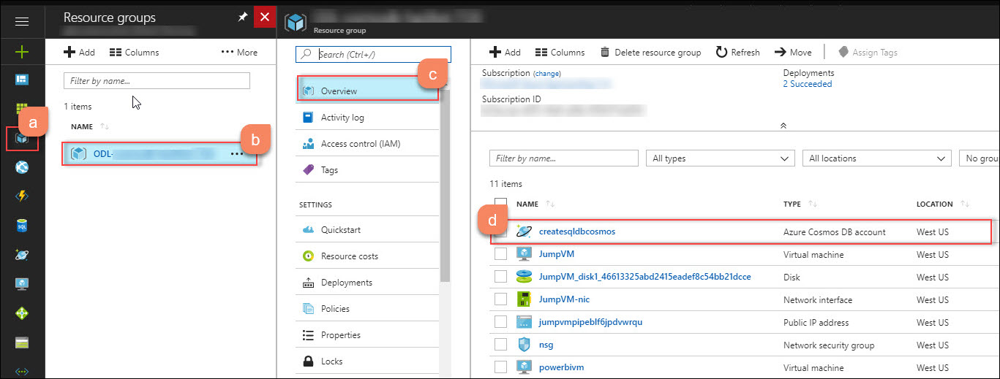

# Module 3: Migrate MongoDB Application to Azure Cosmos DB(SQL API) 
## Access Cosmos DB account with SQL API (created in Module-1)
1. **Launch** a **browser** and navigate to https://portal.azure.com. **Login** with your ** Microsoft Azure** credentials.<br/>
2. **Click** on **Resource Group** which contains the all the resources required for **Cosmbosdb-Hackfest** then click on **Overview** tab and finally click on created **Azure Cosmos DB account**(with SQL API).<br/>
<br/>
3. **Click** on **Keys** option present under Cosmos DB Account blade, and copy **URI** and **PRIMARY KEY**.<br/>

4. **Go** back to **Visual Studio Code** IDE and paste the **URI** value against **DOCUMENT_DB_ENDPOINT**, **PRIMARY KEY** against **DOCUMENT_DB_PRIMARYKEY** and **DOCUMENT_DB_DATABASE** as in the **config.js**.<br/>

5. **Navigate** back to the Azure Portal's Resource groups option present in the favourites menu on the left side panel and select the **resource group** and click on **Azure Cosmos DB Account** then, click on **Replicate data globally** option present under **SETTINGS** section in **Cosmos DB Account** blade.<br/>

6. Copy the **WRITE REGION** and paste it against **DOCUMENT_DB_PREFERRED_REGION** in **config.js** file which is already opened in **Visual Studio Code** IDE and save this file.<br/>
<br/>

7. **Go** to /home/CosmosDB-Hackfest/ContosoAir/src/ContosoAir.Services in file system, right click and select **Open Terimal Here** as shown below:<br/>

8. Now execute the following commands one by one in command prompt.<br/>

```bash
node sql_db_flightinsert.js
node sql_db_insert.js
npm start
```
<br/>

9. Now, to start the **ContosoAir Website** layer, go to /home/CosmosDB-Hackfest/ContosoAir/src/ContosoAir.Website. Open terminal from there and run **ng serve** command in terminal. Minimize the terminal once command is executed, do not exit or CTRL+C.<br/>

```bash
ng serve
```
<br/>

10. It will create three different collections named **SeatsCollection**, **DealsCollection** and **BookingsCollection** with sample data.<br/>

11. Switch to **Azure Portal**, navigate to **Resource groups** option present in the favourites menu on the left side panel and select the resource group then click on **Azure Cosmos DB Account** named.<br/>

12. **Click** on **Data Explorer** option. It will display the collection created in **Azure Cosmos DB Account**.<br/>
<br/>
